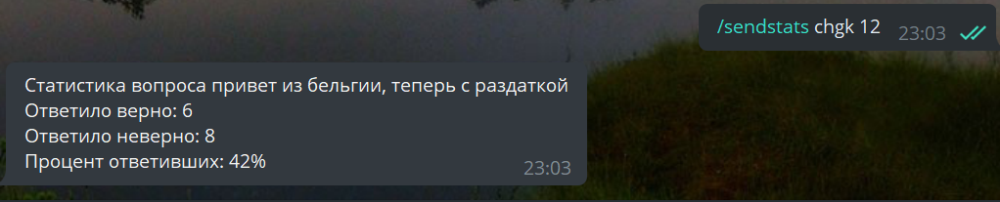
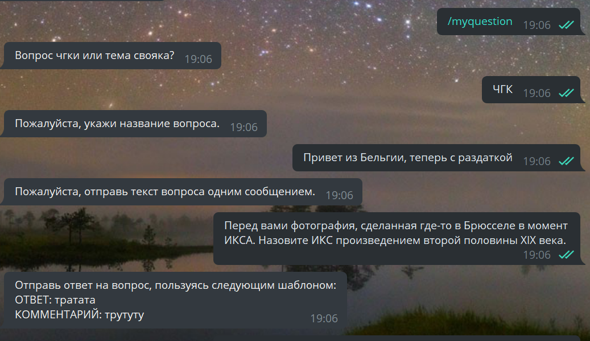

# Otvetbot
## Overview
Otvetbot (which is russian for "answerbot") is a [Telegram](https://telegram.org/) chat-bot. 
It was created to satellite my Telegram channel about interesting facts and 
variations from quiz questions: 

- "Что? Где? Когда?" (referred to as "chgk", can be translated as
[What? Where? When?](https://en.wikipedia.org/wiki/What%3F_Where%3F_When%3F))
- "Своя игра" (referred to as "SI" or "svoyak", can be translated as My Own Game, 
but is actually the russian analogue for [Jeopardy!](https://ru.wikipedia.org/wiki/Jeopardy!))

Users can send their own facts and questions, participate in the statistics
about the difficulty of the question, and message me with the feedback through the bot.

That's how the dialog with the bot looks:

Want to chat with the bot yourself? It's waiting for your message [here](https://t.me/faktikibot)!

## Technical Details

The bot was written in **Python**, with the **python-telegram-bot** library. The bot stores the data about the questions 
and facts in the **PostgreSQL** database, to interact with which I used the **psycopg2** library.

The code is deployed on [Heroku](https://heroku.com/home), which I think is a great
beginner-friendly service. And it has a free plan :)

## The Museum of Bad Code

Otvetbot is my first big project ever. I wrote it in 2019, which is a year and a half back from now, where 
"now" is when I'm writing this readme.

It was quite a challenge for me, then, but I totally liked it. But a year and a half ago I didn't know anything
about _beautiful code_. Working code was pretty okay. Also, I didn't know anything about git, or databases, sooooo.....

_.... storing my data by commiting it to the Github repository seemed a good idea ...._

Well, that's shameful. (Yeah, this is why this repository has like 500 commits)

But then I went to the University, where I had excellent programming teachers. So that's where it got me in a year.
In 2020, after adding this project to my CV, I understood that I have to rewrite it using my newly gained skills and
knowledge.

I enjoy seeing the evolution that happened. That's why I didn't just delete this repo and create the new one with
the updated bot. [See the pull request](https://github.com/elizabethfeden/otvetbot/pull/2) for the detailed
description of the changes, I think that's quite interesting.

Maybe in two years I'll stumble upon this project and get frightened by the code in it. I hope I will, because this
would mean another big quality jump in my coding experience. Although I think it's pretty good now :) By the way, 
take your time to add issues for the parts you think I should improve.